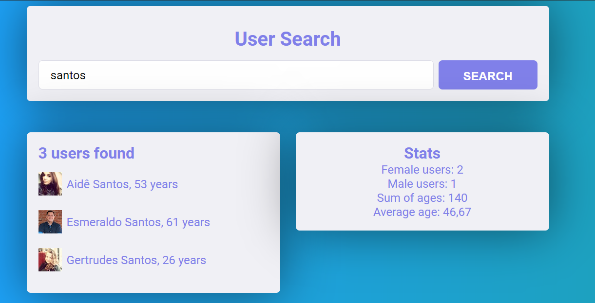

# User Search Application

## About this Project

The idea of the app is to solve the first Challenge of IGTI FullStack Bootcamp.

## Functionalities

- Responsive design

- Fetch [data](https://randomuser.me/api/?seed=javascript&results=100&nat=BR&noinfo) using ES6 async await

- Filter data and see stats


## Why?

This project is part of my personal portfolio, so, I'll be happy if you could provide me any feedback about the project, code, structure or anything that you can report that could make me a better developer!

Email-me: harrisonhenrisn@gmail.com

Connect with me at [LinkedIn](https://linkedin.com/in/harrison-henri-dos-santos-nascimento-a6ba33112).

Also, you can use this Project as you wish, be for study, be for make improvements or earn money with it!

It's free!

## Install

Clone the repo using

```
$ git clone https://github.com/HarrisonHenri/igti-bootcamp-full-stack-react.git
```

Move to fundamentos-htlm-css-js dir

```
$ cd fundamentos-htlm-css-js
```

## Contributing

You can send how many PR's do you want, I'll be glad to analyse and accept them! And if you have any question about the project...

Email-me: harrisonhenrisn@gmail.com

Connect with me at [LinkedIn](https://linkedin.com/in/harrison-henri-dos-santos-nascimento-a6ba33112).

Thank you!
